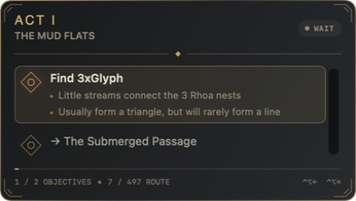
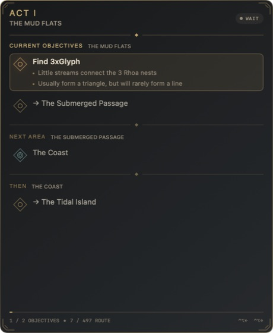

# Exile Route

Exile Route is a native macOS campaign overlay for Path of Exile played through GeForce NOW. It shows every objective for the current zone, advances between zones from locally recognized area names, and always remains usable with manual shortcuts.

The visual identity is an original dark occult interface made with SwiftUI shapes and a procedurally textured smoked-glass panel. No Path of Exile logo, font, texture, map, or icon is distributed by this project. Exile Route is not affiliated with or endorsed by Grinding Gear Games.

Route content and route-language concepts are derived from [HeartofPhos/exile-leveling](https://github.com/HeartofPhos/exile-leveling), used under its MIT license. The bundled offline snapshot is pinned to commit `bbcc7163bdc6f03e0d2276f2dd8bf32e68db6b16`.



The compact panel keeps the complete checklist for the current zone visible. The expanded panel adds every hint and previews the next two zone visits.



## Requirements

- Apple Silicon Mac
- macOS 15 or newer
- GeForce NOW with Path of Exile configured in English for OCR auto-progress
- Screen Recording permission only when OCR auto-progress is enabled

## Install

1. Download `ExileRoute-1.0.0.zip` and its checksum from the [latest release](https://github.com/smace/exile-route/releases/latest).
2. Optionally verify it with `shasum -a 256 -c ExileRoute-1.0.0.zip.sha256`.
3. Unzip the app and move `ExileRoute.app` to `/Applications`.
4. On first launch, control-click the app and choose **Open**. This v1 is ad hoc signed and is not notarized.
5. Grant Screen Recording permission when macOS asks. Restart Exile Route after changing that permission.

Exile Route is a menu-bar app. The overlay appears automatically while GeForce NOW is the frontmost application and hides when focus leaves it.

## Controls

Default global shortcuts:

| Action | Shortcut |
| --- | --- |
| Reopen previous objective | `⌃⌥←` |
| Complete current objective | `⌃⌥→` |
| Compact / expanded | `⌃⌥Space` |
| Show / hide preview | `⌃⌥O` |
| Interaction / click-through | `⌃⌥I` |

Shortcuts are configurable in Settings. Interaction mode allows the panel to be moved; Settings also controls opacity, text size, route options, and OCR calibration.

Each zone visit has its own checklist, including its exit as the final objective. Completed objectives are checked, the current objective is highlighted, and upcoming objectives remain visible. If OCR confirms a new zone before every objective is checked, Exile Route marks the unfinished objectives as skipped and displays a four-second warning. Press Previous once to return to the first skipped objective; OCR will not immediately bounce the checklist back to the newer zone.

The menu-bar item provides manual navigation, forced visibility, OCR pause/resume, route updates, settings, and progress reset.

## Routes

The complete ten-act campaign snapshot is embedded for offline use. Exile Route can:

- update from a precise upstream commit only after every route and data file validates;
- retain the previous valid cache if download or validation fails;
- import route text, a text file, clipboard content, an HTTPS URL, or a Pastebin URL;
- export the active route to a text file or the clipboard;
- persist the active route, progress, options, shortcuts, OCR crop, and per-display panel position in `Application Support/Exile Route`.

## OCR privacy and safety

ScreenCaptureKit filters capture to the largest on-screen window owned by `com.nvidia.gfnpc.mall`. Vision reads only the calibrated upper-right region and uses the bundled area names as custom vocabulary.

Frames are processed in memory on the Mac. They are never saved or uploaded. Automatic progression requires two coherent detections, only selects a nearby expected zone visit, and never regresses. OCR does not attempt to recognize quest items, bosses, or NPC interactions; those objectives remain manual. A distant match is presented as a manual suggestion. Previous and next shortcuts remain available at all times.

## Build and test

Development requires Xcode 16 or newer and XcodeGen.

```sh
brew install xcodegen
./scripts/generate-project.sh
xcodebuild test -project ExileRoute.xcodeproj -scheme ExileRoute -destination 'platform=macOS,arch=arm64'
./scripts/build-release.sh
```

CI regenerates the project, validates the bundled snapshot, builds without distribution signing, and runs the unit and visual snapshot tests on macOS.

See [CONTRIBUTING.md](CONTRIBUTING.md) for the post-v1 pull request workflow and [docs/QA-v1.0.0.md](docs/QA-v1.0.0.md) for release validation.

## License

Exile Route is released under the [MIT License](LICENSE). HeartofPhos attribution and the upstream MIT license are bundled in the application.
