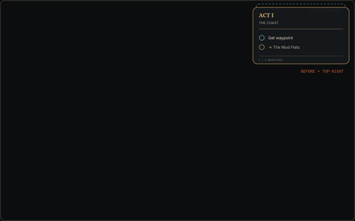
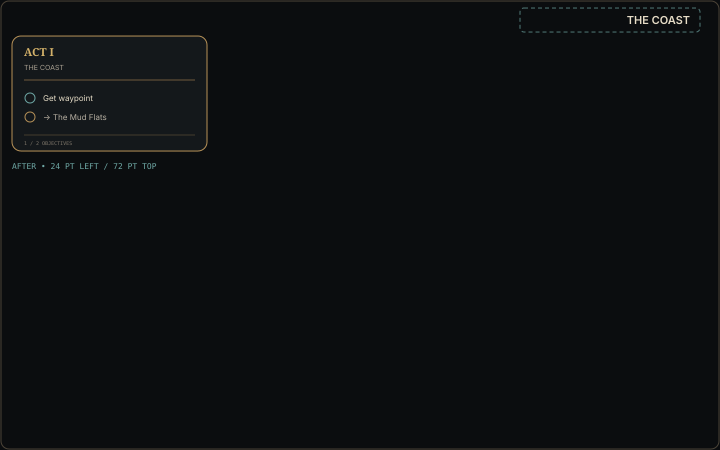

# Overlay placement QA

## Visual reference

These neutral diagrams contain no Path of Exile or Grinding Gear Games assets.
The dashed cyan rectangle represents the persistent area-name region used by
OCR; it remains unobstructed.

| Before — top-right | After — top-left below the area label |
| --- | --- |
|  |  |

## Automated validation

- [x] Default placement uses a 24-point leading inset.
- [x] The overlay starts 72 points below the top of the visible display.
- [x] Negative display coordinates are supported for monitors left of the main display.
- [x] Compact/expanded resizing preserves the top-left anchor.
- [x] Placement is constrained to the visible display.
- [x] Saved pre-migration geometry is ignored once, cleared, and replaced atomically.

## GeForce NOW validation

- [ ] The overlay appears at the top-left on the first launch after updating.
- [ ] The persistent area label remains visible.
- [ ] Compact checklist growth keeps the same top-left anchor.
- [ ] Interaction-mode movement is saved and restored on the same display.
