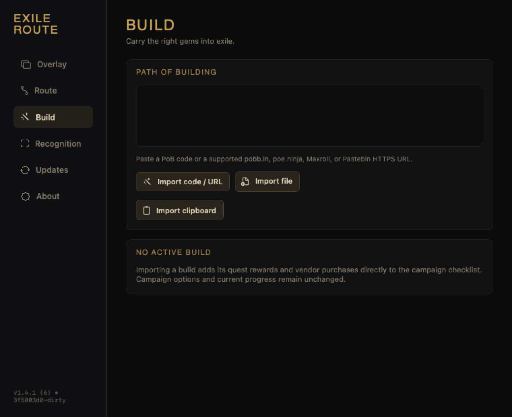
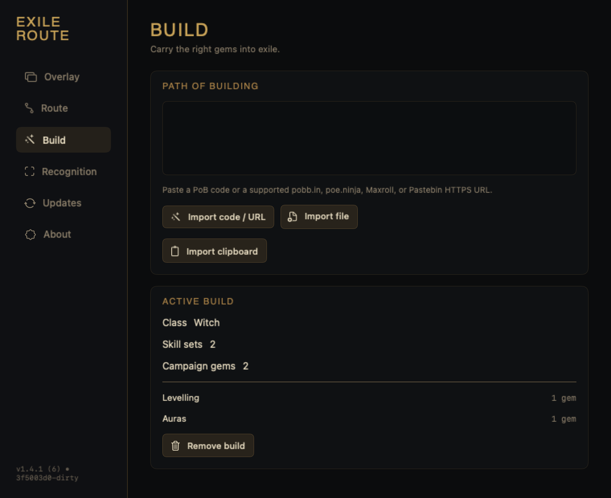
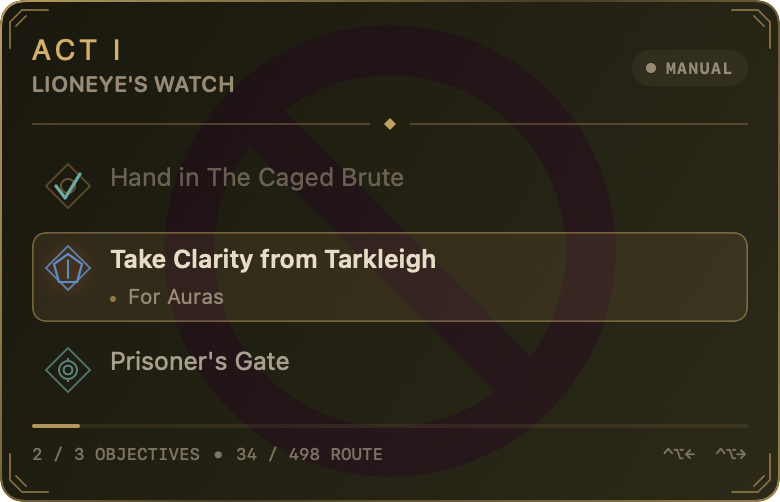

# PoB build import QA

Branch: `feat/pob-build-import`

Upstream data commit: `bbcc7163bdc6f03e0d2276f2dd8bf32e68db6b16`

## Automated coverage

- Base64URL and zlib checksum validation
- malformed and oversized compressed or expanded input
- modern `<SkillSet>` and legacy `<Skills>` documents
- enabled skills, disabled skills, color-code cleanup, and gem deduplication
- Vaal, Awakened, and known Path of Building identifier remapping
- unknown and campaign-unavailable gem warnings
- character starting gems, class restrictions, one quest reward, vendor purchases, NPCs, and costs
- supported URL rewrites, rejected hosts, rejected insecure URLs, HTTP failures, redirects, and response limits
- import, replacement, removal, failed-import rollback, and campaign-objective rebasing
- legacy route-cache fallback to the bundled gem catalog
- persisted normalized build round trip
- Build settings and gem-objective visual references

## Visual references

Before import:

After import:

Campaign acquisition objective:

## Manual Dev checklist

- [x] Build with `./scripts/build-local-dev.sh`
- [x] Confirm the bundle is `Exile Route Dev` with identifier `com.swannmace.ExileRoute.Dev`
- [x] Import the real public multi-skill-set PoB `https://maxroll.gg/poe/pob/8p17060o`
- [x] Confirm a campaign already in progress remains on the same campaign objective
- [x] Inspect Act 1 and Act 2 reward and purchase rows
- [x] Confirm seller, currency cost, skill-set context, and attribute color
- [x] Remove the build from an active gem purchase and confirm resumption on its campaign parent
- [x] Confirm Previous and Next remain available; navigation and rebasing pass XCTest coverage
- [x] Confirm OCR settings and recognition remain available
- [x] Confirm Stable application data and installation are untouched

## Manual Dev result

The public Scion PoB produced 16 non-empty active skill sets and 35 deduplicated campaign gems. Importing at route objective 25 kept **Hand in The Dweller of the Deep** active while inserting the relevant gem objectives around it.

The Act 1 checklist showed a quest reward from Tarkleigh and vendor purchases from Nessa with their currency costs. The Act 2 checklist showed **Herald of Ash** from Greust and purchases from Yeena, including **Summon Skitterbots**, **Herald of Purity**, **Tempest Shield**, and **Wave of Conviction** at an Orb of Alteration each.

Removing the build while **Buy Herald of Purity from Yeena** was active resumed on **Hand in Intruders in Black**, its stable campaign parent. OCR remained enabled and waiting for GeForce NOW. The Dev state used for the progressed-campaign scenario was backed up and restored after QA.
