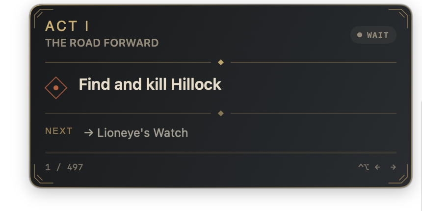
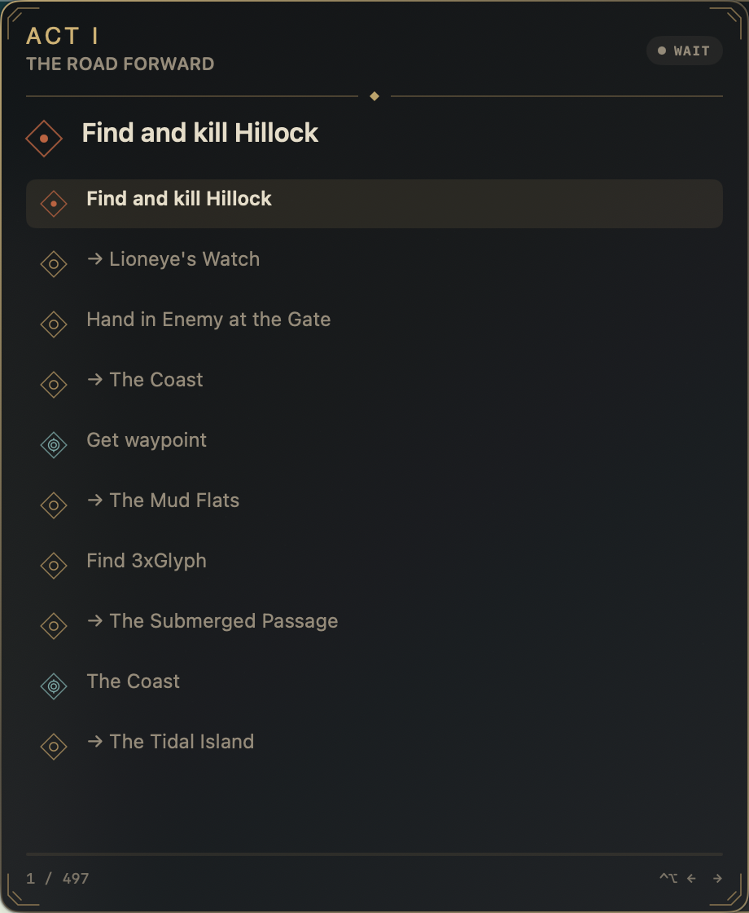

# Zone objective checklist QA

## Visual reference

The v1 captures remain the baseline. The new captures were made from a neutral local preview of the native `NSPanel`; they do not contain Path of Exile or Grinding Gear Games assets.

| Mode | Before — v1 | After — zone checklist |
| --- | --- | --- |
| Compact |  |  |
| Expanded |  |  |

## Automated validation

- [x] Bundled snapshot validation.
- [x] Full macOS test suite: 33 tests, 0 failures.
- [x] Parser coverage for zone context, waypoint, logout, portal return, repeated visits, and bundled routes.
- [x] Progression coverage for manual completion, skipped recovery, coherent OCR confirmation, duplicate areas, distant jumps, and no regression.
- [x] Backward-compatible restoration without `skippedStepIDs`.
- [x] Visual renders for short and seven-objective visits, four objective states, enlarged text, compact, expanded, interaction, OCR error, and skipped warning.
- [x] Apple Silicon Release build.

## Native preview validation

- [x] Compact width remains 390 points and height adapts to content.
- [x] Expanded mode remains 460 × 560 points.
- [x] Active hints appear in compact mode; all available hints appear in expanded mode.
- [x] Current visit and next two visits are grouped by area.
- [x] Original dark occult shapes and palette remain legible on the neutral preview background.
- [x] Overlay remains click-through outside interaction mode.

## GeForce NOW validation

- [ ] Arrive in Lioneye's Watch, then The Coast, with the expected checklist in each area.
- [ ] Complete one objective manually with Next.
- [ ] Change area with an unfinished objective, see the four-second warning, and recover it with Previous.
- [ ] Confirm three successive OCR area transitions.
- [ ] Confirm no focus, keyboard, mouse, permission-dialog, or crash regression.
- [ ] Confirm offline route operation.
